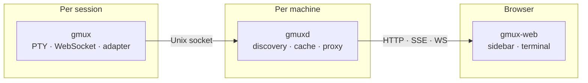
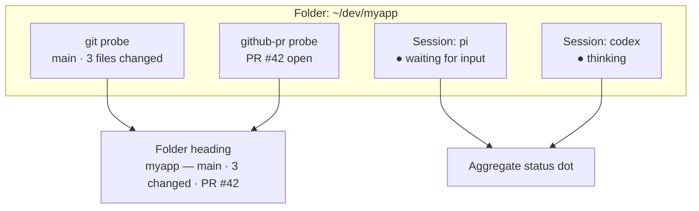
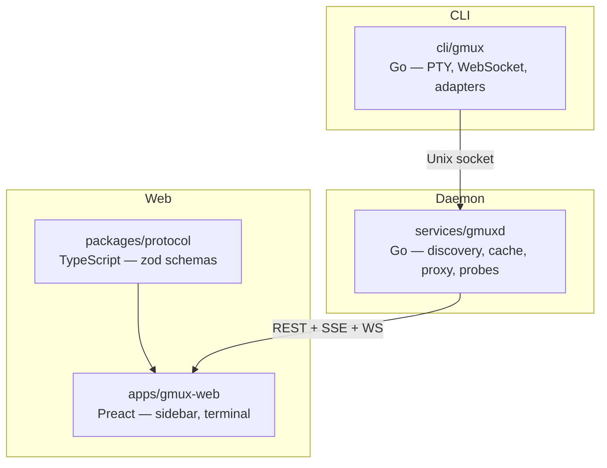

# gmux

**Keep tabs on every AI agent, test runner, and long-running process across your machines. Work from your desktop, steer from your phone.**

Launch any command as a managed session. gmux gives you a live, interactive terminal for each one — grouped by project, with real-time status updates pushed to your browser. When an agent needs input, you'll know. When tests fail, you'll see it. Switch to your phone and the same view is there, ready for you to course-correct.

No Electron, no desktop app. Just a browser and two small binaries.

## Install

**macOS (Homebrew)**

```bash
brew install gmuxapp/tap/gmux
```

**Linux**

```bash
curl -sSfL https://gmux.app/install.sh | sh
```

Or download both binaries (`gmux` and `gmuxd`) from [GitHub Releases](https://github.com/gmuxapp/gmux/releases). On Windows, use the Linux installation inside WSL.

## Quick start

```bash
gmux -- pi                 # launch a coding agent
gmux -- pytest --watch     # launch a test watcher
gmux -- make build         # or literally any command
gmux -d -- pi              # detached; prints the session ID
gmux open                  # open the UI
```

Open `localhost:8790` — all sessions are there, grouped by project and repository, with live status indicators. Click one to attach a full terminal. The same xterm.js that powers the VS Code terminal runs in your browser.

The daemon (`gmuxd`) starts automatically on first use. Bare `gmux` prints help; use `gmux open` to launch the dashboard and `gmux daemon status` to inspect the daemon.

### CLI at a glance

```bash
gmux ls [--all] [--json]       # list local or connected-host sessions
gmux attach <id>               # reattach in the current terminal
gmux tail <id> [-n N] [--raw]  # print a scrollback snapshot
gmux send <id> <text> Enter    # type into a session and submit
gmux wait <id> [--timeout N]   # wait for an agent turn to become idle
gmux kill <id>                 # terminate a running session
gmux dismiss <full-session-id> # terminate if needed, then remove
gmux auth                       # show this host's token/connect URL
gmux remote                     # set up or check Tailscale access
gmux daemon start|stop|restart|status|log-path
```

Session IDs are local by default. Address a connected host explicitly as `<id>@<peer>`. See the [CLI reference](apps/website/src/content/docs/reference/cli.md) for `send-keys`, scripting behavior, and full command details.

## How it works



**`gmux`** wraps any command in a managed session. It allocates a PTY, serves a WebSocket for terminal access, and runs an **adapter** that understands what the child process is doing. Built-in pi, Claude Code, and Codex adapters report working, idle, error, and unread transitions; any child can publish a richer label through `PUT /status`. A generic command gets alive/dead/activity tracking out of the box.

**`gmuxd`** runs once per machine (auto-started by `gmux`). It discovers runner-authoritative sessions via their Unix sockets, caches their state, proxies WebSocket connections, and pushes real-time updates to the browser via SSE. Runtime sessions are rebuildable after a restart; project configuration, peer metadata, and bounded scrollback remain persisted. It can also connect directly to authenticated gmuxd peers and Docker devcontainers.

**`gmux-web`** is the browser UI. The sidebar groups sessions by repository and working directory, with status dots that pulse when something needs attention. The terminal is xterm.js — the same battle-tested terminal emulator that powers VS Code's integrated terminal — with serialized output/reset handling for reliable session switching and bounded persisted scrollback (up to roughly 2 MiB per runner) that replays on reconnect. On coarse-pointer devices, gmux uses a single IME input path so composition updates are not duplicated by xterm's deferred handlers.

## What you see

```
┌─────────────────────────────────────┐
│ gmux                          alpha │
│                                     │
│ ▼ myapp                        ● 2  │
│   main · 3 changed · PR #42        │
│                                     │
│   ● fix auth bug               now  │
│     thinking · pi                   │
│                                     │
│   ● refactor adapters         2m ago │
│     thinking · codex                 │
│                                     │
│ ▼ gmux                         ● 1  │
│   feature/probes · clean            │
│                                     │
│   ● bootstrap                  5m   │
│     waiting for input · pi          │
│                                     │
│ ▸ docs                        ○ 1   │
│   main · completed                  │
└─────────────────────────────────────┘
```

Sessions are grouped into **folders** by working directory. Each folder heading is enriched by **probes** — lightweight observers that report git branch, dirty state, open PRs, or anything you script. The folder's status dot reflects the most urgent session inside it.

## Features

### Sessions
- **Launch anything** — `gmux -- <command>` wraps any process in a managed session
- **Full terminal** — xterm.js with WebSocket transport, the same terminal emulator as VS Code
- **Workspace file previews** — click local Markdown, text/code, or image paths in terminal output to inspect them inside gmux without executing files
- **Bounded persisted scrollback** — up to roughly 2 MiB per runner replays on reconnect and remains available after runner exit
- **Reliable switching** — DEC 2026 synchronized output, connection ownership checks, and serialized writes prevent stale data from the previous session from clearing or contaminating the new terminal
- **Session lifecycle** — live status, exit codes, kill from the UI
- **Pi session naming** — rename a live Pi conversation from the sidebar through Pi's own session API, without injecting terminal input or changing its URL
- **Reconnecting** — tab away and return to the live terminal with bounded history replayed when a reconnect is needed

### Adapters — session-level intelligence
Adapters teach gmux how to work with specific tools. They're compiled into the binary and selected automatically by command name.

- **Auto-detection** — `gmux -- pi` recognizes pi and activates the pi adapter. No flags needed.
- **Rich status** — built-in agent adapters report working, idle, error, and unread transitions; children can publish custom labels such as test or build results
- **Child awareness** — any tool can self-report status via `PUT /status` on `$GMUX_SOCKET`, no adapter required
- **Graceful fallback** — unknown commands get the shell adapter

### Probes — directory-level intelligence
Probes run on the gmuxd that owns each working directory and enrich local or remote folder headings with project context.



- **Git** — branch name, dirty file count
- **GitHub PR** — PR number, status, clickable link
- **Script probes** — drop an executable `.sh` file in `~/.config/gmux/probes/`; gmux runs it with a bounded timeout and accepts one JSON object containing `label`, `value`, optional `status`, and optional HTTP(S) `url`

### UI
- **Triage-first sidebar** — within each folder, unread sessions come first, then errors, working sessions, and idle or resumable sessions
- **Resizable desktop sidebar** — drag the sidebar's right edge, use its keyboard-accessible separator, or double-click to reset; the width persists locally
- **Automatic folders** — unstamped sessions sharing a normalized workspace root (or cwd) on the same origin host group automatically, without changing `projects.json`
- **Selected-session header** — contextual metadata and actions stay visible for the selected terminal
- **Mobile responsive** — the same scoped URL works on desktop or phone for selecting a session and sending input
- **Mobile IME streaming** — coarse-pointer composition updates use one textarea-to-PTY path, avoiding delayed, duplicated, or resurrected text; verified with Android Chrome and Samsung Keyboard
- **URL scoping** — `?project=myapp` and `?cwd=/path` filter the existing session view and remain bookmarkable
- **Near-black dark theme** — neutral black surfaces with Nord Frost and Aurora accents, plus locally bundled Inter UI and JetBrains Mono terminal typography

### Architecture
- **Runner-authoritative** — gmux is the source of truth, gmuxd is a rebuildable cache
- **Hub-and-spoke peering** — a dashboard gmuxd connects directly to authenticated hosts; each node publishes only the local and devcontainer sessions it owns, so network peers are not recursively re-exported
- **Devcontainer discovery** — the Docker watcher can connect container-local gmuxd instances automatically
- **No external dependencies** — no tmux, no screen, no abduco. Two Go binaries and a web app.
- **Web-first** — works on desktop, tablet, phone. Same URL everywhere.
- **Zero config locally** — run `gmux -- <command>`, open a browser

## Multiple machines and remote access

Use one gmuxd as a dashboard hub and connect other machines as authenticated spokes. gmux does not automatically trust or connect every machine on your tailnet: run `gmux auth` on the remote host, then paste its connect URL into **Settings → Hosts → Connect to host**. A bare session ID remains local; supported remote commands such as `attach`, `tail`, `send`, and `kill` address the owning host as `<id>@<peer>` (`wait` and `dismiss` remain local-only).

For devcontainers, add the gmux Feature and the host Docker watcher connects them automatically:

```json
"features": {
  "ghcr.io/gmuxapp/features/gmux": {}
}
```

Localhost is intentionally not reachable from a phone. Run `gmux remote` to enable HTTPS access through Tailscale, then authenticate with the host token from `gmux auth`. Remote access is for your own devices, not collaboration: anyone authorized can read terminal output, type commands, launch processes, and kill sessions — effectively SSH-level access.

See [Devcontainers](apps/website/src/content/docs/devcontainers.md), [Remote Access](apps/website/src/content/docs/remote-access.md), and [Security](apps/website/src/content/docs/security.md).

## Extensibility

| Layer | Mechanism | Runs in | What it does |
|-------|-----------|---------|--------------|
| Session | **Adapters** (Go) | gmux | Recognize commands, monitor output, report rich status |
| Directory | **Built-in probes** (git + GitHub CLI) | gmuxd | Report branch, dirty count, and open PR metadata |
| Child process | **HTTP API** on `$GMUX_SOCKET` | child | Self-report status without any adapter |
| User scripts | **Executable `.sh` probes** in `~/.config/gmux/probes/` | gmuxd | Return bounded JSON directory intelligence without compilation |

## Development

See [CONTRIBUTING.md](CONTRIBUTING.md) for prerequisites and setup.

```bash
pnpm install                # JS dependencies
./scripts/dev-server.sh     # start all services with watch/HMR
```

### Monorepo layout



| Path | Language | Purpose |
|------|----------|---------|
| `cli/gmux` | Go | Session launcher — PTY, WebSocket, adapters |
| `services/gmuxd` | Go | Machine daemon — discovery, cache, WS proxy, embedded web UI |
| `apps/gmux-web` | TypeScript/Preact | Browser UI — sidebar, terminal, header bar |
| `packages/protocol` | TypeScript | Shared schemas, zod-validated |
| `apps/website` | Astro/Starlight | Documentation site |

## Docs

Documentation lives in the [website](apps/website/src/content/docs/):

- [Getting Started](apps/website/src/content/docs/getting-started.mdx) — installation and first session
- [CLI Reference](apps/website/src/content/docs/reference/cli.md) — commands and scripting behavior
- [Architecture](apps/website/src/content/docs/architecture.md) — runtime structure (gmux, gmuxd, web UI)
- [Devcontainers](apps/website/src/content/docs/devcontainers.md) — automatic Docker discovery
- [Session Schema](apps/website/src/content/docs/develop/session-schema.md) — metadata model
- [Adapter Architecture](apps/website/src/content/docs/develop/adapter-architecture.md) — how adapters work
- [Security](apps/website/src/content/docs/security.md) — threat model and safeguards
- [Remote Access](apps/website/src/content/docs/remote-access.md) — Tailscale setup

## License

MIT
